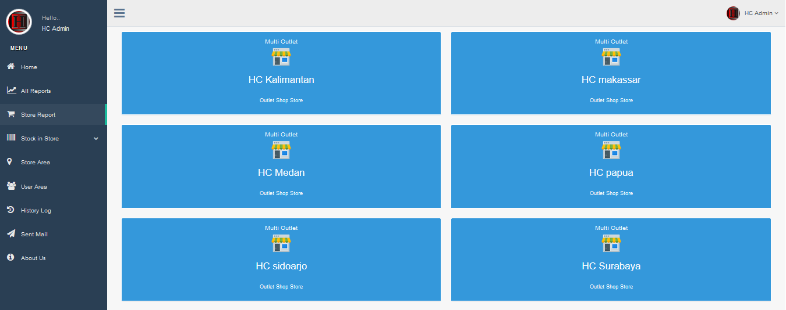

Multi pos adalah solusi terbaik untuk [software program kasir online multi cabang](https://mesinkasir.netlify.com/multicabang/) dengan menggunakan web based system menjadikan sempurna dalam kebutuhan untuk instalasi via clouds yang artinya tidak perlu lagi ada nya instalasi pada device smartphone android iphone hingga mesin kasir windows kamu,cukup akses via website mu dan lakukan pekerjaan mu sangat cepat dengan web based modern menjadikan mobilitas dan kompleks nya kebutuhan untuk monitoring pembukuan usaha mu dimana saja dan kapan saja secara real time online.

dengan system multi cabang memudahkan dalam pendaftaran seluruh cabang cabang toko kamu disini multi pos special untuk kebutuhan akan [multi cabang](https://mesinkasir.netlify.com/multicabang/) dengan simple system dan tentunya kompleks akan kebutuhan pembukuan plus alert minimum stok menjadi lebih baik untuk dipergunakan dalam menunjang usaha mu. kelebihan dengan all transaksi akan ditarik masuk kepusat menjadi lebih baik dalam akses data, selanjutnya split databased per toko toko cabang memudahkan transaksi dan pembukuan dengan berbagai bidang usaha pada masing masing toko cabang ,setiap transaksi yang terjadi databased akan ditarik masuk kepusat dalam kemudahan pembukuan secara live time online, inilah revolusi digital terbaik untuk mu.

Feature tersedia :
+ Admin login server
+ Client login cabang
+ Pendaftaran cabang toko by admin server
+ Register User staff admin cabang by server
+ Pelanggan per cabang
+ Supplier per cabang
+ Group merk produk per cabang
+ Produk jual support barcode kode by cabang
+ Transaksi in stok inventori management cabang
+ Transaksi penjualan POS Point of sale kasir cabang
+ Alert minimum stok cabang
+ Laporan inventori per cabang by admin
+ Laporan pendapatan omset per cabang
+ Laporan pendapatan global seluruh cabang
+ Log out

[Download Program](https://mesinkasir.github.io/e-catalog/MULTIPOS%20OUTLET.pdf)

Cek video nya disini
[Demo](https://youtu.be/1dcU3I-Ozcs)