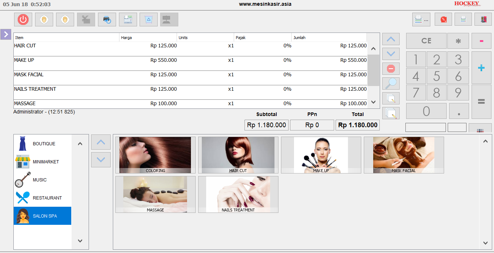

Terbaik untuk mesin kasir mu dengan kompleks system dapat digunakan pada usaha dengan kebutuhan complete maupun simple [software kasir program kasir lengkap](https://mesinkasir.netlify.com/softwarekasirlengkap/) ini dapat digunakan dalam menunjang berbagai kebutuhan seperti usaha supermarket , minimarket, toko modern,mart,store shop, toko mainan,toko baju butik distro, salon spa, apotik, bengkel, penjualan produk dan jasa tersedia untuk digunakan dalam berbagai kebutuhan, fitur pilihan produk semakin memudahkan dalam penjualan dengan variant produk , rakitan dan paket produk hingga kebutuhan inventori management lengkap dengan alasan misalnya produk rusak karena expired date dan lain lain.

kebutuhan akan pembagian divisi juga tersedia dalam mempercepat pekerjaan seperti divisi stok inventori warehouse gudang - divisi pickup  - divisi [kasir](https://mesinkasir.netlify.com/softwarekasirlengkap/) - divisi finance keuangan - divisi admin semakin membuat pembukuan terata dengan rapi, dan tentu fitur modern menjadi prioritas untuk digunakan tampilan modern UI dengan desain grafis yang halus hingga hadirnya pilihan tema dan icon membuat nyaman nya untuk digunakan dalam kelengkapan system yang digunakan.

Feature tersedia :
+ Master based : user - hak akses - pelanggan - supplier - kategori  produk - produk jual dengan gambar foto produk include barcode - pilihan produk - lokasi area penjualan misalnya kasa lantai 1 2 dst - gudang - pajak ppn - produk rakitan dengan penggabungan beberapa item produk lengkap dengan qty digunakan - paket produk - dll
+ In out stok : untuk melakukan transaksi in out stok , misalnya pembelian in stok , dan untuk out stok misal nya barang rusak , barang dibuat display dan lain lain.
+ Ecer produk : Fitur untuk melakukan konversi stok dengan cara membuka produk pak untuk di ecer yang langsung mengkonversi jumlah stok pak berkurang 1 dan menambah jumlah stok ecer produk sesuai dengan banyaknya per pak untuk di ecer.
+ Point of sale pos kasir penjualan : transaksi dengan metode touchscreen include barcode semakin mempercepat penjualan dan cantik pada display nya
+ PLus Transaksi kasir : pending order untuk memending transaksi pelanggan dan dapat melakukan transaksi pada pelanggan selanjutnya untuk kembali melakukan transaksi pending tinggal klik pending list maka system akan menampilkan pending transaksi pelanggan tersebut.
+ Pickup mode : system yang dipergunakan dengan system pickup yang memudahkan pihak gudang menyiapkan order pelanggan dan menyiapkan serta membawa produk ke kasir sesuai dengan pesanan pelanggan.
+ Transaksi pembayaran pada kasir : cash tunai dengan gambar mata uang , card , dan berbagai transaksi lain.
+ Pembayaran pelanggan member : fitur untuk pembayaran pelanggan member dengan limit credit piutang nya.
+ Arus kas in out : untuk melakukan transaksi in out kas misalnya tambahan modal dari bos masuk in kas, dan pembayaran gaji karyawan serta listrik dan oeprasionalnya masuk pada out kas yang nantinya akan diakumulasikan secara global transaksi - arus kas - laba rugi pada cash flow.
+ Close cash fitur tutup kasir biasa dilakukan pada saat toko akan tutup.
+ Laporan inventori stok detail  dan grafik stok inventori
+ E- catalog brosur produk include dengan gambar produk dan harga , price list produk .
+ Label barcode untuk barcode system
+ Price tags barcode dan harga untuk ditempelkan pada rak display sebagai informasi produk lengkap dengan ID produk barcode nama dan harga yang memudahkan pelanggan dalam cek harga produk.
+ Price checker (optional tambahan) : fitur hardware kasir yang dilengkapi dengan barcode untuk memudahkan pelanggan dalam cek harga via price checker ini.
+ Absensi karyawan pada program dengan fitur chek in dan out untuk absensi digital.
+ Laporan Absensi dan kinerja karyawan
+ Laporan penjualan detail lengkap dengan gafik dan top seller produk yang terjual
+ Laporan cash flow
+ Laporan laba rugi
+ Fitur penggantian tema icon dan display penjualan kasir
+ Metode screen display tersedia untuk memudahkan cek pesanan dan memperlihatkan produk yang di beli pelanggan
+ Update online based dengan clouds databased untuk kebutuhan online system optional

[Download Program](https://mesinkasir.github.io/e-catalog/CHROMPOS%20retail.pdf)

Cek video nya disini 
Teaser](https://youtu.be/S7p1qDybViQ) / 
[Demo](https://www.youtube.com/playlist?list=PLQDm6k9_HvYN3UhrrV1LqEJRFdO7H-NZn) /
[Price Check](https://youtu.be/B864Ctl6Dqs)