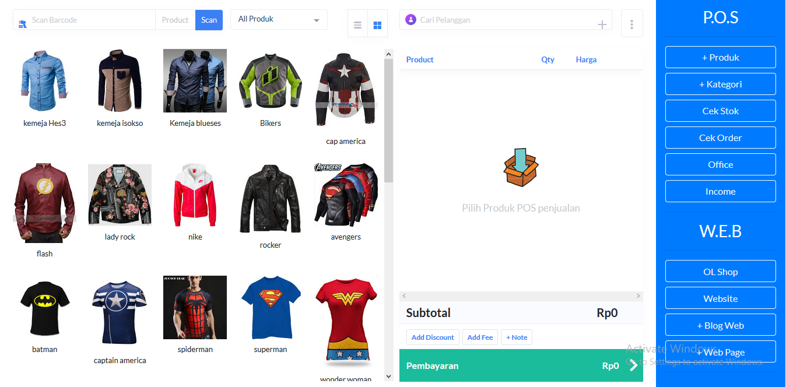

Inilah integrated pos solusi [toko online shop plus aplikasi kasir online](https://mesinkasir.netlify.com/tokoonlineshop/) dalam integrasi yang memudahkan dalam melakukan transaksi secara cepat via toko online shop website mu maupun via aplikasi mesin kasir online mu, modern technology saat ini untuk kemajuan usaha mu.

Dengan web based system memudahkan untuk diakses via smartphone [android maupun iphone](https://mesinkasir.netlify.com/tokoonlineshop/) metode transaksi modern memudahkan pelanggan dalam melakukan order secara online via website toko online mu include dengan petunjuk cara transaksi online maupun via aplikasi mesin kasir online untuk kebutuhan transaksi secara langsung dengan pelanggan yang datang langsung ke toko shop store kamu, laporan laporan detail tersedia dalam rangkuman yang memudahkan untuk cek pembukuan mu dimana saja dan kapan saja secara real time online inilah digital revolutions untuk usaha mu.

Feature tersedia :
+ Online Databased
+ Website toko online shop
+ Kategori dan kelompok group produk
+ Produk jual include dengan kode barcode
+ Inventori stok management
+ Penggunaan pilihan produk misal warna ukuran dll
+ Penjualan POS  point of sale dengan gambar produk touchscreen maupun barcode system ready
+ Penjualan dan pemesanan via online shop order
+ Laporan detail inventori
+ Laporan pemesanan order
+ Laporan penjualan detail
+ Laporan omset pendatan income
+ Update blog dan website info
+ All terintegrasi dalam satu aplikasi ini
+ Log out

[Download Program](https://mesinkasir.github.io/e-catalog/Integrated%20pos.pdf)

Cek video nya disini
[Demo](https://youtu.be/PLvUtkUF9uo?list=PLQDm6k9_HvYNBkHFGWTzsNWA3ZQEHrCsD)